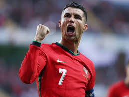
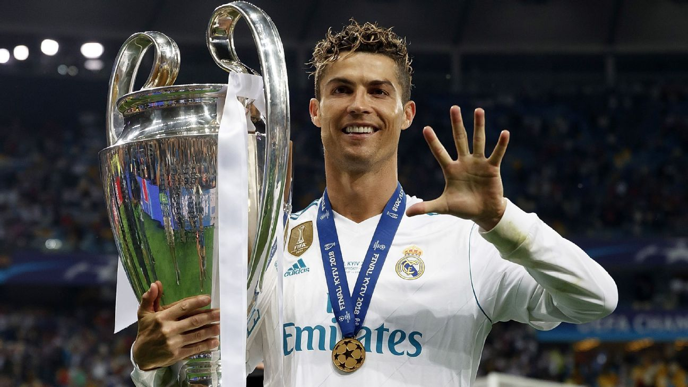

# Tributo-a-um-idolo

<!DOCTYPE html>
<html lang="pt-br">

<head>
    <meta charset="UTF-8">
    <title>Tributo a Cristiano Ronaldo</title>
</head>

<body>

    <header>
        <h1>Cristiano Ronaldo</h1>
        
O maior esportista do mundo e um exemplo de superação.

         
    </header>

    <main>
        <aside>
            <h3>Ficha de Identificação</h3> 
            
<strong>Nome Completo:</strong> Cristiano Ronaldo dos Santos Aveiro

            
<strong>Nascimento:</strong> 5 de fevereiro de 1985

            
<strong>Local:</strong> Funchal, Madeira, Portugal

            
<strong>Apelido:</strong> CR7

        </aside>

        <section>
            <h2>Introdução</h2>
            

                Cristiano Ronaldo é amplamente reconhecido como um dos <i>maiores jogadores de futebol de todos os
                    tempos</i>.
                Sua trajetória é marcada por uma <b>ética de trabalho incansável</b>, transformando-se de um jovem
                talentoso na Ilha da Madeira
                em um fenômeno global que quebrou quase todos os recordes possíveis no esporte.
            

        </section>

        <section>
            <h2>Carreira Profissional</h2>
            

                A carreira de CR7 começou no Sporting CP, mas foi no Manchester United que ele se tornou uma <b>estrela
                    mundial</b>.
                Posteriormente, no Real Madrid, ele atingiu o seu ápice, tornando-se o <i>maior artilheiro da história
                    do clube</i>.
                Ele também teve passagens marcantes pela Juventus e um retorno ao United, antes de levar seu talento
                para o Al-Nassr.
            

            
Algumas características que definem seu estilo:

            <ul>
                <li>Capacidade de impulsão e cabeceio fenomenais</li>
                <li>Precisão em cobranças de falta e pênaltis</li>
                <li>Mentalidade vencedora e liderança em campo</li>
            </ul>
        </section>

        <section>
            <h2>Principais Conquistas</h2>
            <table border="1">
                <thead>
                    <tr>
                        <th>Conquista</th>
                        <th>Ano</th>
                    </tr>
                </thead>
                <tbody>
                    <tr>
                        <td>Primeira Bola de Ouro (Ballon d'Or)</td>
                        <td>2008</td>
                    </tr>
                    <tr>
                        <td>Título da Eurocopa (Portugal)</td>
                        <td>2016</td>
                    </tr>
                    <tr>
                        <td>Pentacampeonato da Champions League</td>
                        <td>2018</td>
                    </tr>
                    <tr>
                        <td>Maior Artilheiro de Seleções Nacionais</td>
                        <td>2021</td>
                    </tr>
                </tbody>
            </table>
        </section>

        <section>
            <h2>Legado e Influência</h2>
            

                O impacto de Cristiano Ronaldo vai muito além das quatro linhas. Ele é a <b>pessoa mais seguida no
                    Instagram</b>,
                utilizando sua plataforma para promover o <i>bem-estar físico</i> e causas sociais.
                Sua disciplina serve como um <b>guia prático</b> para qualquer profissional que deseja o sucesso.
            

            
Fatos sobre sua influência:

            <ol>
                <li>Incentivo global à prática de exercícios</li>
                <li>Recordes de audiência em todas as ligas onde jogou</li>
                <li>Filantropia ativa em hospitais infantis</li>
            </ol>
            
Para muitos, ele é a <i>definição de superação</i> e <b>perseverança</b>.

        </section>
    </main>

    <footer>
        

        
<strong>Fontes:</strong> <a href="https://www.uefa.com">UEFA.com</a> |
            <a href="https://www.fifa.com">FIFA.com</a>
        

        
Página criada em: 26 de janeiro de 2026

    </footer>

</body>

</html>
